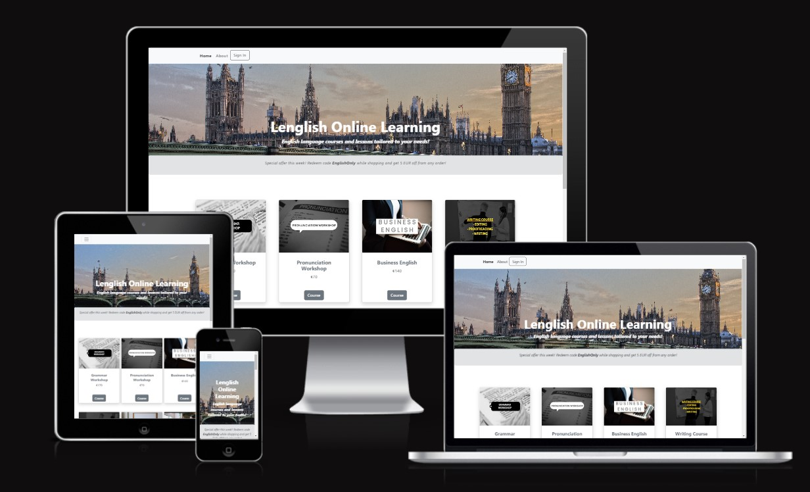
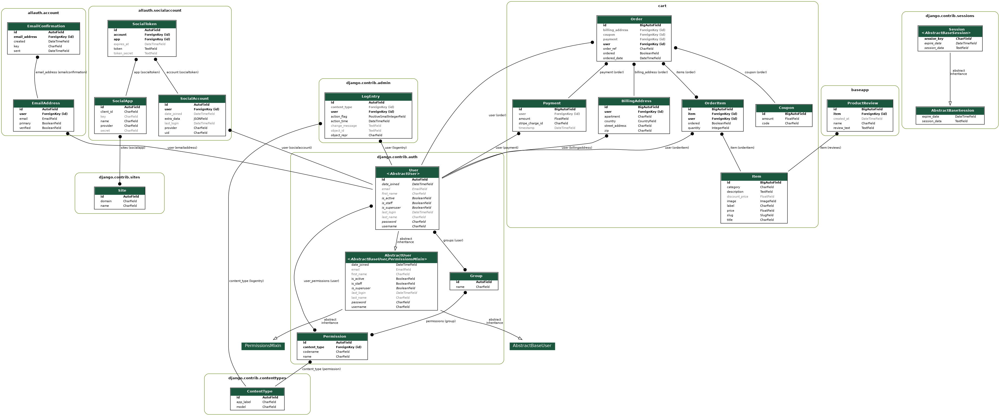

Lenglish Online Learning is an e-commerce website that provides English language courses/lessons.

[View the live project here.](https://lenglishonlinelearning.herokuapp.com/)

## The purpose of this site 

This site has intention to enable learners/students to access necessary information on English language courses/lessons and to easily purchase them.
Also, users are in position to read and leave reviews in order to further improve the quality of the content offered.

## User Experience

### User Goals

**First time site visitors would like to**

 * Easily navigate on the site.
 * Find courses they wish to purchase and necessary information.

**Returning registered users would like**

  * Purchase lessons/courses.
  * Leave and see other reviews below each of courses.

### Site Owners Goals

 * Enable easy to navigate experience for every site visitor or user.
 * Enable any site visitor to easily create account.
 * Enable every user to easily register and sign in.
 * Enable site users to easily add items to cart and proceed to checkout.
 * Enable site users to easily purchase lessons/courses they want.

 ### USER STORIES

Issue No. | Title | User story | Acceptance criteria | Implemented
----------|-------|------------|---------------------|-------
#01 | Create home page with products display | As a Site User I can see and access all items so that I can decide what to purchase. | Acceptance Criteria: Site users can see and access all items on the home page. | Yes
#02 | Create product detail page | As a shopper, I want to see product descriptions. As a shopper, I want to add products/items to my cart. | Acceptance Criteria: Shoppers can see product descriptions. Shoppers can add products to the cart. | Yes
#03 | Create order and payment pages | As a site user, I want to add/remove items to/from the cart. As a site user, I want to add my details. As a site user, I want to get a site feedback when adding/removing items or applying the purchase option. | Acceptance Criteria: Shoppers can add/remove their items to/from the cart. Shoppers can add their details necessary for the purchase. Shoppers can get a site feedback when adding/removing items or applying the purchase option. | Yes
#04 | Product management within admin section | As a site admin, I want to create, edit or delete items. | Acceptance Criteria: Site admin can easily create, edit or delete items. | Yes
#05 | Site registration and login functionality | As a site user, I want to register on the website. As a site user, I want to login into the website. As a site user, I want to log out off the website. As a site user, I can verify my email address and get an email confirmation of my registration. | Acceptance Criteria: Site users can easily register, log in or log out. Site users can authenticate their accounts by getting an email confirmation. | Yes
#06 | Create custom 404/500 pages | As a site owner, I want to redirect users to the custom 404/500 error pages. | Acceptance Criteria: Site users can easily return to the home page once they see 404/500 error page. | Yes
#07 | Create order history page | As a site user, I want to access and see what I've ordered previously. | Acceptance Criteria: Site users can easily see their previously ordered lessons/courses. | Yes
#08 | User reviews | As a site user, I want to create, edit and delete my reviews for all items. As a site admin, I want to limit reviews to only one per user. | Acceptance Criteria: Site users can leave, edit and delete their reviews. Site users cannot leave more than one review per item. | Yes

### STRATEGY

* Focus:

  The focus of this project is to provide possibility to users/customers/potential students to easily purchase and review offered courses/lessons.

* Definition:

  Lenglish Online Learning is an e-commerce website intended for purchase of English language courses/lessons.

* Value:

  The registered users can purchase and review courses/lessons.

**Agile software development**

Throughout development process of this site, agile development approach was taken using Github projects tool (everything listed above under "user stories").

### SCOPE

**Features:**

  **Navigation menu** - The navigation menu is clear and consistent for all visitors and users.

  **Home page** - Home page enables visitors/users to easily switch between 2 categories of posts or use navigation menu functions.

  **Register/Login/Logout page** - Site visitors can register at register page or sign in at login page.

  **Product detail page** -  Site visitors can see all the product details necessary as well as reviews. Registered users can submit, edit and delete reviews as well.

  **Cart summary page** - Registered users can add/remove items from cart and purchase them via checkout procedure.

  **Billing address page** – Registered users can fill in the details necessary for checkout and apply coupon code if available.

  **Checkout page** – Registered users can complete their purchase.

  **Order history page** – Registered users can see their order history with all the necessary details.

  **Edit/delete review pages** – Registered users can submit/edit/delete reviews.

  **Admin page** - This page is restricted to the site administrator and is used for the full control of all blog features.

   **Planned Features:**
  * The site should be responsive, intuitive and easy to navigate on all devices.
  * Home page should provide easy navigation and access for each item card.
  * Users should be able to easily register/login/logout.
  * Only registered users can purchase lessons/courses, submit product reviews and view the order history.
  * Unregistered users can just view lessons/courses and reviews.
  * Every site visitor can access about page in order to contact site admin or find out how does the site and process of purchase/teaching function.

### SKELETON
  **Wireframe:**
  The basic mockup for this site was done in Balsamiq Wireframes and can be viewed below:
  
  [Wireframes PDF](https://github.com/jurica29/lenglishonlinelearning/static/readme/wireframes.pdf)

  **Database:**

  

Database schema

      
  

## SURFACE
  **Colour Pallette:**

  
  	
  **Typography:**

 Default fonts were used throughout the website.

### Technologies

  * HTML5 
  * CSS3 
  * Python
  * Django 
  * AWS
  * Bootstrap 5
  * FontAwesome 
  * Google Fonts
  * GitPod 
  * GitHub 
  * DevTools 
  * Heroku 