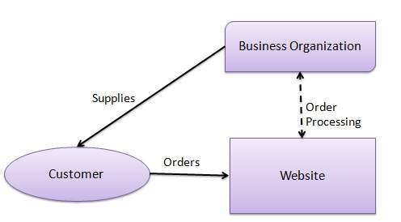
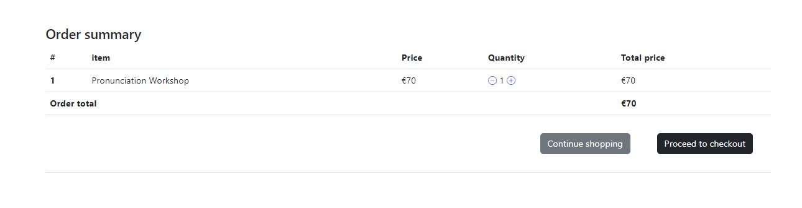

Lenglish Online Learning is an e-commerce website that provides English language courses/lessons.

[View the live project here.](https://lenglishonlinelearning.herokuapp.com/)

## The purpose of this site 

This site has intention to enable learners/students to access necessary information on English language courses/lessons and to easily purchase them.
Also, users are in position to read and leave reviews in order to further improve the quality of the content offered.

## User Experience

### User Goals

**First time site visitors would like to**

 * Easily navigate on the site.
 * Find courses they wish to purchase and necessary information.

**Returning registered users would like**

  * Purchase lessons/courses.
  * Leave and see other reviews below each of courses.

### Site Owners Goals

 * Enable easy to navigate experience for every site visitor or user.
 * Enable any site visitor to easily create account.
 * Enable every user to easily register and sign in.
 * Enable every user to subscribe to the newsletter.
 * Enable site users to easily add items to cart and proceed to checkout.
 * Enable site users to easily purchase lessons/courses they want.

 ### USER STORIES

Issue No. | Title | User story | Acceptance criteria | Implemented
----------|-------|------------|---------------------|-------
#01 | Create home page with products display | As a Site User I can see and access all items so that I can decide what to purchase. | Acceptance Criteria: Site users can see and access all items on the home page. | Yes
#02 | Create product detail page | As a shopper, I want to see product descriptions. As a shopper, I want to add products/items to my cart. | Acceptance Criteria: Shoppers can see product descriptions. Shoppers can add products to the cart. | Yes
#03 | Create order and payment pages | As a site user, I want to add/remove items to/from the cart. As a site user, I want to add my details. As a site user, I want to get a site feedback when adding/removing items or applying the purchase option. | Acceptance Criteria: Shoppers can add/remove their items to/from the cart. Shoppers can add their details necessary for the purchase. Shoppers can get a site feedback when adding/removing items or applying the purchase option. | Yes
#04 | Product management within admin section | As a site admin, I want to create, edit or delete items. | Acceptance Criteria: Site admin can easily create, edit or delete items. | Yes
#05 | Site registration and login functionality | As a site user, I want to register on the website. As a site user, I want to login into the website. As a site user, I want to log out off the website. As a site user, I can verify my email address and get an email confirmation of my registration. | Acceptance Criteria: Site users can easily register, log in or log out. Site users can authenticate their accounts by getting an email confirmation. | Yes
#06 | Create custom 404/500 pages | As a site owner, I want to redirect users to the custom 404/500 error pages. | Acceptance Criteria: Site users can easily return to the home page once they see 404/500 error page. | Yes
#07 | Create order history page | As a site user, I want to access and see what I've ordered previously. | Acceptance Criteria: Site users can easily see their previously ordered lessons/courses. | Yes
#08 | User reviews | As a site user, I want to create, edit and delete my reviews for all items. As a site admin, I want to limit reviews to only one per user. | Acceptance Criteria: Site users can leave, edit and delete their reviews. Site users cannot leave more than one review per item. | Yes

### STRATEGY

* Focus:

  The focus of this project is to provide possibility to users/customers/potential students to easily purchase and review offered courses/lessons.

* Definition:

  Lenglish Online Learning is an e-commerce website intended for purchase of English language courses/lessons.

* Value:

  The registered users can purchase and review courses/lessons.

**Agile software development**

Throughout development process of this site, agile development approach was taken using Github projects tool (everything listed above under "user stories").

### SCOPE

**Features:**

  **Navigation menu** - The navigation menu is clear and consistent for all visitors and users.

  **Home page** - Home page enables visitors/users to easily browse lessons/courses offered.

  **Register/Login/Logout page** - Site visitors can register at register page or sign in at login page.

  **Product detail page** -  Site visitors can see all the product details necessary as well as reviews. Registered users can submit, edit and delete reviews as well.

  **Cart summary page** - Registered users can add/remove items from cart and purchase them via checkout procedure.

  **Billing address page** – Registered users can fill in the details necessary for checkout and apply coupon code if available.

  **Checkout page** – Registered users can complete their purchase.

  **Order history page** – Registered users can see their order history with all the necessary details.

  **Edit/delete review pages** – Registered users can submit/edit/delete reviews.

  **Admin page** - This page is restricted to the site administrator and is used for the full control of all blog features.

   **Planned Features:**
  * The site should be responsive, intuitive and easy to navigate on all devices.
  * Home page should provide easy navigation and access for each item card.
  * Users should be able to easily register/login/logout.
  * Only registered users can purchase lessons/courses, submit product reviews and view the order history.
  * Unregistered users can just view lessons/courses and reviews.
  * Every site visitor can access about page in order to contact site admin or find out how does the site work.

### SKELETON
  **Wireframe:**
  The basic mockup for this site was done in Balsamiq Wireframes and can be viewed below:
  
  [Wireframes PDF](https://github.com/jurica29/lenglishonlinelearning/blob/main/static/readme/wireframes.pdf)

  **Database:**

  

Database schema

      
  

## SURFACE
  **Colour Pallette:**

  
  	
  **Typography:**

 Default fonts were used throughout the website.

### Technologies

  * HTML5 
  * CSS3 
  * Python
  * Django 
  * AWS
  * Bootstrap 5
  * FontAwesome 
  * Google Fonts
  * GitPod 
  * GitHub 
  * DevTools 
  * Heroku 

 ### Business and marketing

 * A traditional B2C (Business to Customer) application has been chosen, with a straightforward and user-friendly responsive interface.

 

B2C model

      
 

 * This e-commerce website offers lessons/courses to the customer. The customer can purchase any of the provided lessons/courses and then tutor/teacher
 reaches out to them to confirm the suitable dates and time via email. It is all arranged easily and quickly.

 * The website also has Facebook business page which is available as a supplementary means for marketing.

 

Facebook business page

      
 

 * Users can also subscribe to the newsletter to receive all offers in their email box. Subscription box is available in the footer area of the website and provided by MailChimp.

 

Newsletter signup

      
 

  ## Existing Features

 ### Elements on every page
 
   * Navbar

      There is a consistent navbar present for all pages within the site.
      Navbar has 3 buttons for non-registered users: 

      * Home, About and Sign In.

      

Navbar

      
      

      

Navbar mobile

      
      

      The layout changes once user is signed in.
      
      

Navbar when user is signed in

      
      

  * Footer

    There is a consistent footer present for all pages within the site, containing three social media icons, privacy policy link and newsletter signup button (MailChimp).

    

Footer

    
    

  
  * Home/Landing page

    Home page immediately enables visitors and users to browse through lessons/courses and find out more once they click on them.
    Also, anyone can access "About" tab and find out more about teacher and the way in which the website should provide service to customers/students.
    
    

Home

    
    

  * Toasts/Pop-up messages

    Major user actions are followed by pop-up messages/toasts that display proper feedback for each of those actions.
    
    

Message

    
    

  * Product Detail page

    Every site visitor can access product detail page for each of the listed products/courses.
    Site user can add items to the cart while non-registered site visitor cannot.

    

Product detail

    
    

  * Review section

    Review section below product is restricted to registered users. 
    However, any visitor can see reviews and then make a decision if they want to proceed with further actions.

    

Review section

    
    

  * Edit Review page

    Edit review page for registered users only.

    

Edit review

    
    

  * Delete Review page

    Delete review page for registered users only.

    

Delete review

    
    

  * Signup page

    This page can be opened via the register button in the navigation bar.
    New site visitors are simply asked to enter username, email address, password and password confirmation to register for the use of this site. 
    After that, user gets an email in order to confirm their account email.
    Once successfully registered, users will be redirected to the home page and have access to comments section below posts.

    

Signup page

    
    

  * Sign in page

    Registered and returning users can use the login button to open the login page and supply their username and password to login.
    On successful login, users will be redirected to the home page and they will be aware of it due to login username displayed in the upper right navbar area.

    

Login page

    
    

  * Sign out page

    Logout notification is very simple and it displays a message that user is logged out successfully.

    

Logout page

    
    

  * About page

    Any site visitor can use contact page to reach out to the site owner.
    There are three fields that user needs to fill in: name, email and message.
    After submitting the message user will get a notification of being successful.

    

About page

    
    

  
  * Billing address page

    This page is displayed once user proceeds to checkout from "cart" page.
    At this stage, user is prompted to input billing address details and apply coupon if needed.

    

Billing Address page

    
    

    
  * Cart summary page

    Every registered user can see his added items in the cart and remove/add them as per need.

    

Cart

    
    

    If the cart is empty then message will be displayed/items are removed from it.

    

Empty cart

    
    

  * Checkout page

    Final step for the checkout procedure where user can complete the purchase.

    

Checkout

    
    

  * Order history page

    Customer is redirected to this page once purchase is completed.
    Every registered user can see his/her order history with all relevant information needed.

    

Order history

    
    

  * Custom 404/500 error page

    

Custom error page

    
    

### Features Left to Implement

  Due to the amount of time given to complete this project, I was unable to implement following planned features:

  * Email confirmation for orders
  * Profile page which enables users to save their details (like billing address)
  * Add another page for video learning content for purchase
  * Add calendar system for booking lessons.

## Testing

### Responsiveness 

The site is tested to ensure all pages are displayed appropriately in all screen sizes.

### Manual testing

  Manual testing was conducted to ensure the site works as intended. Testing document can be found here [Link to the testing document](static/documentation/testing.md)

### Errors encountered during development

  1) HTML errors generated by Django widget for country selection.
  2) Deployment was a bit problematic but fixed it in the end with the help of tutor support.
  3) Order confirmation email could not be implemented due to some issues, so I've decided to leave it out in the end.
  4) Minor bug where coupon code needs to be put in prior to any billing address details.
  
### Known error present:

  No known errors present at the time of submission. 

###  Validating code - Python, HTML, CSS, JS

All the .py files are validated with PEP8 within gitpod environment.

"Black" used for linting purposes as recommended by my mentor: [Black](https://github.com/psf/black)

However, switching to PEP8 in order to check if any major errors are present and to take screenshots of validation within gitpod environment.

The result screenshot of one of the file
 
 

This has caused 20 warnings "line too long" showing up. No other errors or warnings were shown.

2 errors were shown when "Billing address page" passed through the HTML validator due to Django country selector widget generated elements.
I've tried working with tutor support on this, however there were no solutions to be found.

Django widget generated errors
 
 

All the other HTML pages were clean from errors.

The result screenshot - html
 
 

No errors/warnings were found when passing through the official (Jigsaw) validator.

The result screenshot - css
 
 

No errors/warnings were found when passing JS code through the JS Hint validator.

The result screenshot - JS file 1
 
 

The result screenshot - JS file 2
 
 

#### Lighthouse testing results

Test results
 
 

## Setting up Django environment.

Following additional packages are installed to create this site by using pip3 install:
  
  * gunicorn
  * psycopg2
  * django-crispy-forms
  * pep8
  * stripe
  * allauth
  * mailchimp
  * django countries
  * django storages

## Deployment

* Deployment on Heroku

Once you have signed up to Heroku, on the top right of the dashboard there is a button labelled 'New'. This will open a dropdown; please select 'Create new app'. On the next page you can choose your region and a name for the project. Then click 'Create app'.

On the next page there is a menu along the top. Go to 'Settings', where you will find the config vars. Scroll down to the section named 'Config vars' and click on the button labelled 'Reveal config vars'. Cloudinary (AWS?) and Postgres will both need config vars as per your own details. Also, you will need to set a secret key. Once the config vars are saved, back in Gitpod save them in an env.py file. Ensure to add env.py to your .gitignore list so that your config vars do not become publically available on Github.

If you scroll back to the top of the page you will find the 'Deploy' tab, which has multiple options for deployment. When you click on the Github button a bar will come up for you to search for the repo you wish to connect to.

Once you are connected, you have the option to deploy automatically (the app will update every time you push) or manually (update only when you choose). 

* Forking the GitHub Repository 

* By forking the GitHub Repository, you will be able to make a copy of the original repository on your own GitHub account, allowing you to view and/or make changes without affecting the original repository by using the following steps:

    Log in to GitHub and locate the GitHub Repository
    At the top of the Repository (not top of page), just above the "Settings" button on the menu, locate the "Fork" button.
    You should now have a copy of the original repository in your GitHub account.

* Making a Local Clone

    Log in to GitHub and locate the GitHub Repository
    Under the repository name, click "Clone or download".
    To clone the repository using HTTPS, under "Clone with HTTPS", copy the link.
    Open Git Bash
    Change the current working directory to the location where you want the cloned directory to be made.
    Type git clone, and then paste the URL you copied in Step 3.

$ git clone https://github.com/jurica29/lenglishonlinelearning

Press Enter. Your local clone will be created.

## Credits

* Coding
  
  [Django documentation](https://docs.djangoproject.com/en/4.1/)

  [Django tutorial by Codemy.com](https://www.youtube.com/watch?v=B40bteAMM_M&list=PLCC34OHNcOtr025c1kHSPrnP18YPB-NFi&ab_channel=Codemy.com)

  [Django tutorial by Net Ninja](https://www.youtube.com/watch?v=n-FTlQ7Djqc&list=PL4cUxeGkcC9ib4HsrXEYpQnTOTZE1x0uc&ab_channel=TheNetNinja) 

  [JS code for toasts display was adapted from Code Institute's Boutique Ado project.](https://github.com/Code-Institute-Solutions/boutique_ado_v1)

  [JS code for stripe elements was taken and adapted from the website documentation.](https://stripe.com/ie/payments/elements)

  [CSS code for Stripe elements was also taken from stripe website.](https://stripe.com/ie/payments/elements)

* Images taken from:

  [Pixabay](https://pixabay.com/)

* Images edited via Adobe Photoshop.

## Acknowledgements

-	To the Code Institute course material, as the basis of all my knowledge is from here.
-	To the Slack community as I have used the different channels to find answers to problems!
- Stack Overflow as a valuable resource for solving a couple of issues.
- To the Tutor support for all their assistance and patience with my queries and issues.

I would also like to thank to:

-	My mentor Rahul, for his time, support and guidance.
-	My wife Maja, for all her support and patience during this last challenging project.